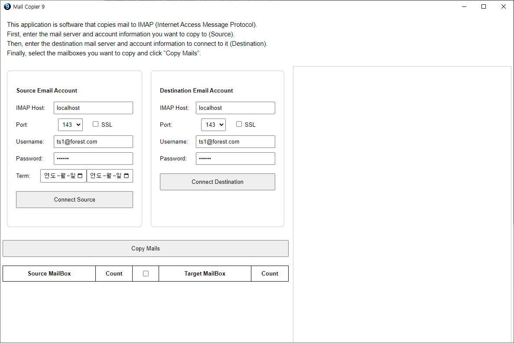

# MailCopier9

This application is software that copies mail to IMAP (Internet Access Message Protocol).

First, enter the mail server and account information you want to copy to (Source).

Then, enter the destination mail server and account information to connect to it (Destination).

Finally, select the mailboxes you want to copy and click “Copy Mails” button.

## Install ##
Since this application is developed with Electron, you need to have NodeJS installed.

You can download and run the source by following the steps below in the console window.

1. Clone source 
   - git clone https://github.com/gujc71/MailCopier9.git
   - cd MailCopier9
2. Installing libraries for nodejs (Electron)
   - npm install
3. Run
   - npm start
   - npm run dist: Create Windows, Mac, and Linux applications 
     : This feature may require administrator privileges on the operating system.

## License ##
MIT
